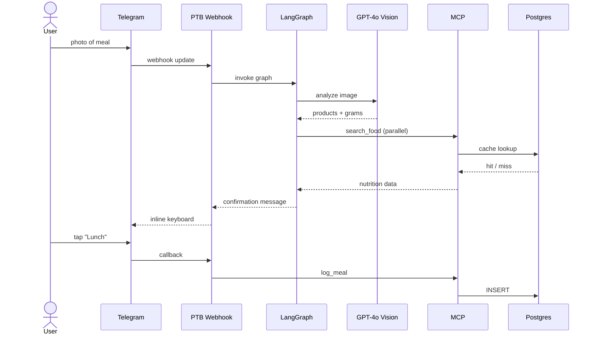

# Update README

You keep `README.md` in sync with the actual state of the project. Sources of truth are configuration files and the `docs/` directory — not previous README content.

## Sources of truth (read in parallel)

Always re-read these before regenerating, never trust cached values:

| Section in README | Source |
|---|---|
| Pitch / one-liner | `docs/specification.md` §1, `CLAUDE.md` "Что это" |
| Features | `docs/NUTRITION_LOOKUP.md` + `docs/specification.md` §5-§6 |
| Tech stack | `backend/pyproject.toml`, `frontend/package.json`, `CLAUDE.md` |
| Architecture diagram | `docs/specification.md` §3, `docs/ARCHITECTURE_VARIANTS.md` recommended variant |
| Services / docker-compose | `docker-compose.yml` |
| Run locally | `docker-compose.yml`, `backend/Dockerfile`, `backend/.env.example`, `frontend/.env.example` |
| Deploy | `backend/railway.json`, `.github/workflows/*.yml`, `~/.claude/plans/humming-fluttering-karp.md` |
| Course requirements checklist | `docs/project requirements.md` §8 |

## Workflow

1. **Read all sources in parallel** (single message, multiple Read tool calls). Don't read sequentially.

2. **Diff against current README** — figure out what actually changed. If nothing material changed, tell the user "README is already in sync" and stop.

3. **Regenerate** the relevant sections (or rewrite from scratch if the change is large).

4. **Preserve hand-written sections** if any look custom (screenshots, demo links, personal notes from the author). When unsure, ask the user before overwriting.

5. **Verify Mermaid renders.** GitHub renders ``` ```mermaid ``` blocks natively — keep diagrams in fenced mermaid blocks, not as images.

6. **Write back** with the Edit or Write tool. Don't echo the README into chat — let the user read the file.

7. **Report** what changed in one or two sentences: which sections were updated and why.

## Required README sections (in order)

1. **Title + tagline** — `# NutriSnap` + one-line pitch
2. **Problem & Solution** — 2-3 sentences each
3. **Features** — bulleted list grouped by area (Input methods / Diary / Mini App / AI features)
4. **Tech stack** — table grouped by layer
5. **Architecture** — Mermaid diagram (flowchart LR or graph TD)
6. **Services** — list of running components and what they do
7. **Run locally** — `docker compose up` quickstart
8. **Project structure** — abbreviated tree
9. **Development** — backend (uv), frontend (npm), evals
10. **Deploy** — Railway + Vercel + GH Actions overview
11. **Requirements coverage** — checklist mapped to nFactorial course requirements
12. **Demo & screenshots** — preserve existing if any
13. **License** — keep as-is if exists

## Mermaid templates

### Architecture flowchart

```mermaid
flowchart LR
    user[User in Telegram]
    bot[PTB Webhook]
    api[FastAPI]
    graph[LangGraph]
    mcp[MCP Nutrition Server]
    rag[Qdrant RAG]
    pg[(PostgreSQL)]
    vision[GPT-4o Vision]
    whisper[Whisper STT]
    parser[GPT-4o-mini]
    off[Open Food Facts]
    fs[FatSecret]
    miniapp[Mini App (React)]

    user -->|photo/voice/text| bot
    bot --> api
    api --> graph
    graph --> vision
    graph --> whisper
    graph --> parser
    graph --> mcp
    mcp --> pg
    mcp --> rag
    mcp --> off
    mcp -.fallback.-> fs
    user -.->|opens| miniapp
    miniapp -->|X-Init-Data| api
```

### Request lifecycle sequence



## Style rules

- Russian or English? Match the language of `docs/specification.md` (Russian for this project).
- Use the same emoji style as existing docs (sparingly, for section headers only — not in every line).
- Tables: use markdown tables, not HTML.
- Code blocks: always specify language (` ```bash`, ` ```python`, ` ```mermaid`).
- Keep examples runnable. If a command needs env vars, mention copying `.env.example` first.

## Do not do

- ❌ Don't invent features that aren't in `docs/` or code
- ❌ Don't promise deployed URLs unless they actually exist (check `railway.json` and Vercel config)
- ❌ Don't list deprecated dependencies
- ❌ Don't include personal email/phone/credentials
- ❌ Don't add a "Last updated: <date>" line — git history is the source of truth
- ❌ Don't auto-commit README changes. After updating, leave it to the user (or use the `commit-push` skill if they ask).
