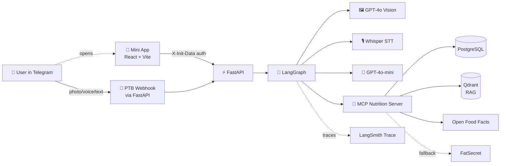
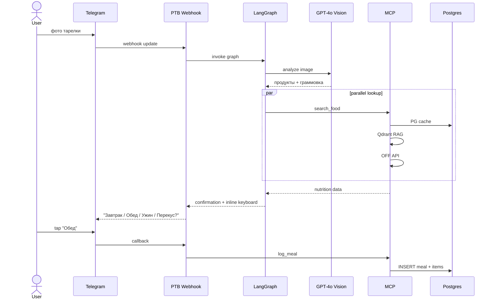

# NutriSnap

> Telegram-бот и Mini App для дневника питания с AI-вводом: фото, голос или текст — без ручного поиска продуктов.

Финальный проект курса **nFactorial LLM Engineer** (май 2026).

---

## Проблема и решение

**Проблема.** В FatSecret и аналогах добавить приём пищи занимает 30-60 секунд: найти продукт, выбрать вариант, ввести вес, повторить для каждого блюда. Эту рутину делают трижды в день — большинство сдаются после первой недели.

**Решение.** NutriSnap записывает приём пищи за один тап:
- Сфоткал тарелку → GPT-4o Vision определяет блюда и граммовку → подтверждение → готово
- Сказал голосом "200 грамм творога на завтрак" → Whisper → парсинг → запись
- Написал текстом → парсинг → запись
- Для постоянных продуктов — inline keyboard с "часто" и "недавно" без AI-вызовов

---

## Фичи

### Ввод приёма пищи
- 📸 Фото блюда → GPT-4o Vision распознаёт продукты и оценивает граммовку
- 🎙 Голосовое сообщение → Whisper транскрибация → парсинг
- ✏️ Текст или пересланное сообщение → GPT-4o-mini структурирует
- 📦 Фото упаковки со штрих-кодом → Open Food Facts → точные КБЖУ
- ⚡ Quick add — топ-5 частых и топ-3 недавних продуктов per приём пищи, один тап

### Поиск продуктов (multi-source)
1. Локальный кэш PostgreSQL
2. Qdrant RAG (USDA seed + ~200 казахских блюд)
3. Open Food Facts (по штрих-коду и текстовый поиск)
4. FatSecret API (fallback для редких EN-only продуктов)
5. GPT-4o-mini estimate (last resort)

### Дневник и аналитика
- Дашборд с кольцевым прогресс-баром калорий и БЖУ
- Месячный календарь дней с цветовой индикацией
- Сводка `/today`, `/week` в боте
- Утренние и вечерние scheduled-рассылки

### Онбординг
- Расчёт TDEE по формуле Миффлина-Сан Жеора (пол, вес, рост, возраст, активность, цель)
- Подсчёт суточных норм калорий, белков, жиров, углеводов

### Mini App
- Дашборд / Календарь / Профиль / Мои блюда (UGC)
- Авторизация через Telegram `initData` (без отдельного логина)
- UI компоненты из `@telegram-apps/telegram-ui` под нативную тему Telegram

---

## Стек

| Слой | Технология |
|---|---|
| Bot | python-telegram-bot 22+, webhook через FastAPI |
| API | FastAPI + uvicorn (async) |
| DB | PostgreSQL 16 + SQLAlchemy 2.0 async + asyncpg + Alembic |
| LLM | OpenAI GPT-4o (vision), GPT-4o-mini (text), Whisper (STT) |
| Agent | LangGraph (тонкие ноды, LLM только где необходимо) |
| Vector DB | Qdrant (RAG + опционально семантический кэш) |
| Embeddings | text-embedding-3-small |
| Trace | LangSmith |
| MCP | Python MCP SDK — Nutrition server (search_food, log_meal, get_daily_summary, lookup_by_barcode) |
| Frontend | React 18 + Vite + TypeScript + Tailwind + shadcn/ui |
| Mini App | @telegram-apps/sdk-react, @telegram-apps/telegram-ui |
| Backend deploy | Railway (api + postgres + qdrant) |
| Frontend deploy | Vercel |
| CI/CD | GitHub Actions (lint, tests, evals на PR) |
| Python packaging | uv |

---

## Архитектура



### Поток обработки фото



---

## Сервисы

Docker Compose (`docker-compose.yml`):

| Сервис | Что делает | Порт (локально) |
|---|---|---|
| `postgres` | основная БД (users, meals, meal_items, foods) | 5432 |
| `qdrant` | векторный поиск для RAG | 6333 |
| `migrate` | прогоняет `alembic upgrade head` и завершается; `api`/`bot` ждут его | — |
| `api` | FastAPI: `/health`, `/telegram/webhook`, Mini App API (`/api/*`) | 8000 |
| `bot` | standalone polling worker для разработки | — |

Mini App **frontend** в Compose не входит — поднимается отдельно через Vite
(`cd frontend && npm run dev`, порт 5173, прокси `/api` → `:8000`).
См. [docs/MINI_APP.md](docs/MINI_APP.md).

В проде `bot` запускается как webhook внутри `api` (один сервис вместо двух),
а `migrate` — это pre-deploy команда Railway.

---

## Запуск локально

### Требования
- Docker + Docker Compose
- Python 3.12 (если хочешь без Docker)
- Node 20+ (для фронта)

### Шаги

```bash
# 1. Клонировать
git clone https://github.com/5kif4a/nutrisnap.git
cd nutrisnap

# 2. Заполнить env
cp backend/.env.example backend/.env
# отредактировать BOT_TOKEN, OPENAI_API_KEY, LANGCHAIN_API_KEY

# 3. Поднять стек
docker compose up

# 4. (отдельно) Миграции БД
docker compose exec api alembic upgrade head

# 5. (опционально) Засидить казахские блюда
docker compose exec api python scripts/seed_kz_foods.py
```

API будет на http://localhost:8000 — проверить healthcheck:
```bash
curl http://localhost:8000/health
```

---

## Структура проекта

```
nutrisnap/
├── backend/                    # FastAPI + bot + LangGraph
│   ├── app/
│   │   ├── main.py            # FastAPI entrypoint (/health, /telegram/webhook, /api)
│   │   ├── core/              # config, settings
│   │   ├── api/               # роуты Mini App (initData auth, /api/me, /api/day)
│   │   ├── bot/               # PTB handlers (start, onboard, meal)
│   │   ├── db/                # SQLAlchemy модели + session
│   │   ├── graph/             # LangGraph граф + ноды
│   │   ├── repositories/      # доступ к данным (user/meal/food repo)
│   │   ├── services/          # OpenAI, OFF, nutrition calc/targets
│   │   ├── mcp/               # MCP nutrition server        (планируется)
│   │   ├── rag/               # Qdrant ingest + retrieval   (планируется)
│   │   └── evals/             # golden dataset + run.py     (планируется)
│   ├── alembic/               # миграции БД
│   ├── scripts/               # healthcheck-скрипты
│   ├── tests/                                              # (планируется)
│   ├── Dockerfile             # multi-stage uv
│   ├── railway.json
│   ├── pyproject.toml         # uv-зависимости
│   └── uv.lock
├── frontend/                   # React + Vite + Tailwind Mini App
│   ├── src/
│   │   ├── main.tsx           # точка входа, init Telegram SDK
│   │   ├── App.tsx            # таб-навигация
│   │   ├── telegram.ts        # @telegram-apps/sdk-react + браузерный фолбэк
│   │   ├── lib/api.ts         # API-клиент (X-Init-Data)
│   │   ├── types.ts           # DTO (зеркало backend schemas)
│   │   ├── pages/             # Dashboard, Profile
│   │   └── components/        # CircularProgress, MacroBar, MealCard, TabBar
│   ├── package.json
│   ├── vite.config.ts         # dev-прокси /api → :8000
│   └── vercel.json
├── docs/                       # спецификации
│   ├── specification.md
│   ├── MINI_APP.md            # экраны, API, локальный запуск Mini App
│   ├── ARCHITECTURE_VARIANTS.md
│   ├── DATABASE_CONCURRENCY.md
│   ├── NUTRITION_LOOKUP.md
│   └── VALUE_PROPOSITION.md
├── .github/workflows/          # CI/CD (backend, frontend, evals)
├── docker-compose.yml
├── CLAUDE.md
└── README.md
```

---

## Разработка

### Backend (uv)
```bash
cd backend
uv sync                                  # установить зависимости
uv run uvicorn app.main:app --reload    # dev server
uv run ruff check .                     # lint
uv run ruff format .                    # format
uv run pytest -q                        # тесты
uv run alembic revision --autogenerate -m "msg"
uv run alembic upgrade head
```

### Frontend (Mini App)

Сначала должен быть поднят backend (API на `:8000`) — см. шаги выше
(`docker compose up -d --build postgres migrate api`). Vite в dev-режиме
проксирует `/api` → `http://localhost:8000`.

```bash
cd frontend
npm install        # установить зависимости (один раз)
npm run dev        # dev-сервер → http://localhost:5173
```

Открой **http://localhost:5173** в браузере. Вне Telegram `X-Init-Data`
пустой → backend в `ENV=development` подставляет dev-юзера, поэтому Mini App
работает без Telegram. Чтобы открыть внутри Telegram, нужен HTTPS (деплой —
см. `docs/MINI_APP.md`).

Прочие команды:
```bash
npm run typecheck  # tsc --noEmit
npm run lint       # eslint
npm run build      # tsc + vite build → dist/
npm run preview    # предпросмотр прод-сборки
```

> Dev-сервер должен работать постоянно, пока тестируешь Mini App.
> Остановить: `pkill -f vite`. Подробности по экранам и API —
> `docs/MINI_APP.md`.

### Evals
```bash
cd backend
uv run python -m app.evals.run --output results.json
```

---

## Деплой

| Компонент | Платформа | Триггер |
|---|---|---|
| Backend (api + bot) | Railway | push в `main`, watch `backend/**` |
| Postgres | Railway addon | managed |
| Qdrant | Railway template | managed |
| Frontend Mini App | Vercel | push в `main` + preview на каждый PR |
| CI lint/tests | GitHub Actions | push + PR на `backend/**`, `frontend/**` |
| Evals | GitHub Actions | PR на `backend/**`, артефакт + comment |

Подробности — в `docs/specification.md` §15.

---

## Покрытие требований курса

| Требование | Статус | Где |
|---|---|---|
| LangGraph workflow с ветвлениями | ✅ | `backend/app/graph/` |
| MCP-сервер с 2+ tools | ✅ | `backend/app/mcp/` (4 tools) |
| Skill с SKILL.md | ✅ | `backend/app/skill/` (KZ блюда) |
| RAG-пайплайн | ✅ | `backend/app/rag/` (Qdrant) |
| Обработка документов / скрапинг | ✅ | USDA seed + OFF API |
| Мультимодальность | ✅ | GPT-4o Vision + Whisper |
| LangSmith трейсинг | ✅ | все LLM-вызовы |
| Golden dataset 30+ примеров + 2 метрики | ✅ | `backend/app/evals/` |
| A/B эксперимент | ✅ | GPT-4o vs GPT-4o-mini Vision |
| Обоснованный выбор LLM + гиперпараметров | ✅ | `docs/specification.md` §13 |
| Web/mobile frontend | ✅ | `frontend/` + Telegram Mini App |
| Guardrails (бонус) | ✅ | keyword + range checks |
| Docker + docker-compose (бонус) | ✅ | корень репо |
| CI/CD с evals на PR (бонус) | ✅ | `.github/workflows/` |
| Деплой на публичный URL (бонус) | ✅ | Railway + Vercel |

---

## Документация

- [Полное ТЗ](docs/specification.md)
- [Архитектурные варианты](docs/ARCHITECTURE_VARIANTS.md)
- [Конкурентность БД](docs/DATABASE_CONCURRENCY.md)
- [Поиск продуктов](docs/NUTRITION_LOOKUP.md)
- [Требования курса](docs/project%20requirements.md)
