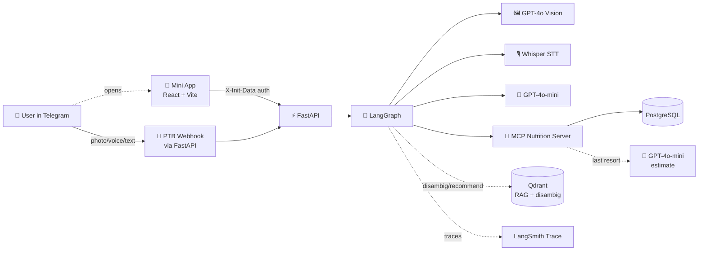
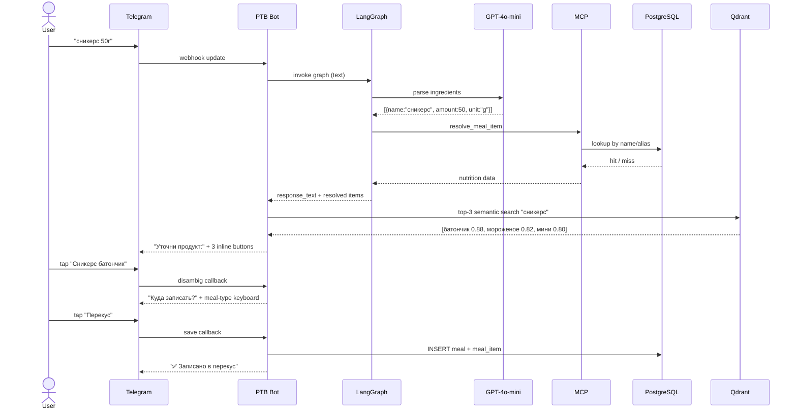

# NutriSnap

> Telegram-бот и Mini App для дневника питания с AI-вводом: фото, голос или текст — без ручного поиска продуктов.

Финальный проект курса **nFactorial LLM Engineer** (май 2026).

---

## Проблема и решение

**Проблема.** В FatSecret и аналогах добавить приём пищи занимает 30-60 секунд: найти продукт, выбрать вариант, ввести вес, повторить для каждого блюда. Эту рутину делают трижды в день — большинство сдаются после первой недели.

**Решение.** NutriSnap записывает приём пищи за один тап:
- Сфоткал тарелку → GPT-4o Vision определяет блюда и граммовку → подтверждение → готово
- Сказал голосом "200 грамм творога на завтрак" → Whisper → парсинг → запись
- Написал текстом → парсинг → запись
- Для постоянных продуктов — inline keyboard с "часто" и "недавно" без AI-вызовов

---

## Фичи

### Ввод приёма пищи
- 📸 Фото блюда / весов / упаковки → GPT-4o Vision распознаёт продукты, читает граммовку с дисплея весов, штрих-код с упаковки
- 🎙 Голосовое сообщение → Whisper транскрибация → парсинг
- ✏️ Текст или пересланное сообщение → GPT-4o-mini структурирует (правила: голое число = граммы, бренды в кириллице/транслите, composite-блюдо = один item)
- 🔍 **Disambiguation top-3**: при однозначном текстовом/голосовом вводе бот делает Qdrant top-3 поиск и показывает inline-кнопки для уточнения («Сникерс батончик / Сникерс мороженое / Сникерс мини») — только если оценки близки (разброс ≤ 0.20)
- ⚡ **Quick Add** под подтверждением приёма: одной кнопкой докинуть в текущий черновик частый продукт юзера на этот тип приёма

### Поиск продуктов

**Основной пайплайн (MCP `resolve_meal_item`):**

| # | Источник | Покрытие | Задержка |
|---|---|---|---|
| 1 | PostgreSQL local cache (barcode → name/alias) | ~80% после прогрева | 10 мс |
| 2 | GPT-4o-mini estimate — ephemeral, не сохраняется | last resort | 1–2 с |

**Qdrant** (`text-embedding-3-small`) используется отдельно:
- Recommender subgraph — top-20 кандидатов для `/recommend`
- Disambiguation — top-3 альтернативы перед подтверждением приёма
- Auto-index hook: каждый новый `Food` (user_recipe, curated seed) embed'ится fire-and-forget

### 🧮 Калькулятор блюд (`/calculate`)

Новая фича для расчёта КБЖУ собственных рецептов без фото:

1. `/calculate` → лайв-панель с пустым списком ингредиентов
2. Отправляй текстом или пересылай список («курица 800\nкартошка 1739\nморковь 495»)
3. Каждое сообщение парсится через граф, добавляется в панель с накопленным итогом
4. Тап «✅ Готово» → расчёт: общий вес, КБЖУ всего блюда, **КБЖУ на 100 г**
5. Дай название → опционально сохрани в базу как `Food` → в следующий раз «150 г жаркОе» за 10 мс из PG

Пересланные сообщения с ингредиентами перехватываются ConversationHandler'ом и НЕ логируются как отдельный приём пищи.

### Дневник и аналитика
- Дашборд с кольцевым прогресс-баром калорий и БЖУ
- Месячный календарь дней с цветовой индикацией (зелёный/жёлтый/красный по доле дневной нормы)
- Сводка `/today`, `/week` в боте
- **Daily morning nudge** в 09:00 Asia/Almaty — сводка вчерашнего + рекомендация на сегодня

### AI Recommender (RAG)
- Команда `/recommend` или кнопка в Mini App → LangGraph-subgraph 4 нод (`gather_user_state → compute_deficit → retrieve_candidates → compose_recommendation`)
- Анализирует сегодняшний дефицит по белкам/жирам/углеводам vs цели, любимые продукты, последние 14 дней (для variety filter)
- Qdrant top-20 кандидатов из каталога + LLM выбирает 3 с обоснованием
- Триггеры: команда, утренний пуш, после большого/позднего приёма (>700ккал OR ≥19:00), при variety-alert (одни и те же блюда 5+ раз/неделю)

### Онбординг
- Расчёт TDEE по формуле Миффлина-Сан Жеора (пол, вес, рост, возраст, активность, цель)
- Подсчёт суточных норм калорий, белков, жиров, углеводов
- ConversationHandler с `PicklePersistence` — стейт переживает рестарты

### Mini App
- **Сегодня** — кольцо калорий, бары Б/Ж/У, приёмы пищи за день, навигация по датам
- **Календарь** — месячная сетка с цветовой индикацией, тап по дню → детальная статистика
- **Продукты** — три таба (Поиск / Недавно / Часто) + селектор приёма сверху. Тап = `POST /api/meals/quick-add`. Поиск дебаунсится 250мс, бьёт `GET /api/foods/search`
- **Профиль** — пол/вес/рост/возраст/активность/цель → пересчёт нормы или ручной override
- Авторизация через Telegram `initData`, браузерный фолбэк для локального теста
- React + Vite + Tailwind; нативные компоненты `@telegram-apps/telegram-ui`, мост/тема через `@telegram-apps/sdk-react`

### Команды бота

| Команда | Что |
|---|---|
| `/start` | Онбординг (расчёт КБЖУ) или приветствие вернувшемуся |
| `/calculate` | Калькулятор блюда по ингредиентам: накапливай список → КБЖУ на 100 г → сохрани в базу |
| `/recommend [запрос]` | RAG-рекомендации (опциональный free-form: "что-то с белком на ужин") |
| `/today` | КБЖУ за сегодня |
| `/week` | Сводка за неделю |
| `/open` | Открыть Mini App |
| `/help` | Справка |
| `/cancel` | Прервать активный диалог (онбординг, калькулятор, recipe builder) |

---

## Стек

| Слой | Технология |
|---|---|
| Bot | python-telegram-bot 22+, webhook через FastAPI |
| API | FastAPI + uvicorn (async) |
| DB | PostgreSQL 16 + SQLAlchemy 2.0 async + asyncpg + Alembic |
| LLM | OpenAI GPT-4o (vision), GPT-4o-mini (text), Whisper (STT) |
| Agent | LangGraph (тонкие ноды, LLM только где необходимо) |
| Vector DB | Qdrant (RAG + опционально семантический кэш) |
| Embeddings | text-embedding-3-small |
| Trace | LangSmith |
| MCP | Python MCP SDK — Nutrition server (`resolve_meal_item`, `lookup_food`, `compute_meal_item_nutrition`, `estimate_food_nutrition`) |
| Frontend | React 18 + Vite + TypeScript + Tailwind |
| Mini App | @telegram-apps/sdk-react, @telegram-apps/telegram-ui |
| Backend deploy | Railway (api + postgres + qdrant) |
| Frontend deploy | Vercel |
| CI/CD | GitHub Actions (lint, tests, evals на PR) |
| Python packaging | uv |

---

## Архитектура



### Поток обработки текста с disambiguation



---

## Сервисы

Два compose-файла: `docker-compose.yml` — прод-стиль (без hot-reload, без bind-mount), `docker-compose.dev.yml` — для разработки (hot-reload через watchfiles, pgadmin, ngrok-тоннель для Mini App).

| Сервис | Что делает | Порт (dev) |
|---|---|---|
| `postgres` | основная БД (users, meals, meal_items, foods) | 5432 |
| `qdrant` | векторный поиск для RAG (collection `foods`) | 6333 |
| `pgadmin` *(dev)* | веб-UI для Postgres, авто-подключение через servers.json | 8081 |
| `migrate` | прогоняет `alembic upgrade head` и завершается; `api`/`bot` ждут его | — |
| `api` | FastAPI: `/health`, `/telegram/webhook`, Mini App API (`/api/*`) | 8000 |
| `bot` | standalone polling worker для разработки + PTB JobQueue (daily nudge) | — |
| `ngrok` *(dev)* | HTTPS-туннель к Vite dev server (для тестов Mini App в Telegram) | 4040 |

Mini App **frontend** в Compose не входит — поднимается отдельно через Vite
(`cd frontend && yarn dev`, порт 5173, прокси `/api` → `:8000`).
См. [docs/MINI_APP.md](docs/MINI_APP.md).

В проде `bot` запускается как webhook внутри `api` (один сервис вместо двух),
а `migrate` — это pre-deploy команда Railway.

---

## Запуск локально

### Требования
- Docker + Docker Compose
- Python 3.12 (если хочешь без Docker)
- Node 20+ (для фронта)

### Шаги

```bash
# 1. Клонировать
git clone https://github.com/5kif4a/nutrisnap.git
cd nutrisnap

# 2. Заполнить env
cp backend/.env.example backend/.env
# отредактировать BOT_TOKEN, OPENAI_API_KEY, LANGCHAIN_API_KEY

# 3. Поднять стек (dev-режим с hot-reload + pgadmin)
docker compose -f docker-compose.dev.yml up -d
# миграции прогоняются автоматически сервисом `migrate` перед запуском api/bot

# 4. Засидить курированный каталог (41 продукт из реальных FatSecret-логов)
docker compose -f docker-compose.dev.yml exec api python -m app.db.seed_foods

# 5. Загрузить эмбеддинги каталога в Qdrant
docker compose -f docker-compose.dev.yml exec api python -m app.rag.ingest_foods
```

API будет на http://localhost:8000 — проверить healthcheck:
```bash
curl http://localhost:8000/health
```

pgAdmin доступен на http://localhost:8081 (логин `admin@nutrisnap.com` / `nutrisnap`, сервер NutriSnap уже зарегистрирован).

---

## Структура проекта

```
nutrisnap/
├── backend/                    # FastAPI + bot + LangGraph + RAG
│   ├── app/
│   │   ├── main.py            # FastAPI entrypoint (/health, /telegram/webhook, /api)
│   │   ├── core/              # config, settings
│   │   ├── api/               # Mini App REST (/api/me, /day, /month, /foods/*, /meals/quick-add, /recommendations)
│   │   ├── bot/
│   │   │   ├── handlers/      # start, onboard, meal, recipe, recommend, calculate, common
│   │   │   ├── jobs.py        # PTB JobQueue: daily nudge + variety detection
│   │   │   ├── keyboards.py   # inline-клавиатуры (Quick Add, meal-type, recipe, disambiguation)
│   │   │   └── application.py # PTB Application + PicklePersistence
│   │   ├── db/                # SQLAlchemy модели, session, seed_foods.py
│   │   ├── graph/
│   │   │   ├── graph.py       # main meal-logging граф
│   │   │   ├── recommender.py # /recommend RAG subgraph (4 nodes)
│   │   │   └── nodes/         # route, vision, transcribe, parser, nutrition, finalize
│   │   ├── rag/
│   │   │   ├── embeddings.py  # text-embedding-3-small wrapper
│   │   │   ├── qdrant.py      # singleton client, semantic search, auto-index hook
│   │   │   └── ingest_foods.py# batch embed всего каталога
│   │   ├── repositories/      # food_repo, meal_repo, user_repo
│   │   ├── services/          # nutrition_calc, meal_drafts, recipe_drafts, recommendation_cache, disambiguation_cache, nudge_throttle
│   │   ├── evals/
│   │   │   ├── golden.jsonl   # 44 кейса (ТГ-сообщения + FatSecret-эталоны + edge)
│   │   │   └── run.py         # runner с pass-rate + MAPE per macro
│   │   └── mcp/               # MCP nutrition server (планируется)
│   ├── alembic/               # миграции БД
│   ├── scripts/               # healthcheck-скрипты
│   ├── Dockerfile             # multi-stage uv
│   ├── railway.json
│   └── pyproject.toml         # uv-зависимости + pylint config
├── frontend/                   # React + Vite + Tailwind Mini App
│   ├── src/
│   │   ├── main.tsx           # точка входа, init Telegram SDK
│   │   ├── App.tsx            # таб-навигация
│   │   ├── telegram.ts        # @telegram-apps/sdk-react + браузерный фолбэк
│   │   ├── lib/api.ts         # API-клиент (X-Init-Data)
│   │   ├── lib/date.ts        # UTC date/month утилиты
│   │   ├── types.ts           # DTO (зеркало backend schemas)
│   │   ├── pages/             # Dashboard, Calendar, MyFoods, Profile
│   │   └── components/        # CircularProgress, MacroBar, MealCard, TabBar
│   ├── package.json
│   ├── vite.config.ts         # dev-прокси /api → :8000
│   └── vercel.json
├── docs/
│   ├── specification.md
│   ├── EVALS.md               # методология + метрики + A/B (37→95.5% pass rate)
│   ├── MINI_APP.md
│   ├── ARCHITECTURE_VARIANTS.md
│   ├── DATABASE_CONCURRENCY.md
│   ├── NUTRITION_LOOKUP.md
│   ├── VALUE_PROPOSITION.md
│   └── golden/food_diary.md   # исходный FatSecret-экспорт юзера (ground truth)
├── .github/workflows/          # CI/CD (backend, frontend, evals)
├── .pgadmin/servers.json       # авто-конфиг pgadmin для dev
├── docker-compose.yml          # prod-style
├── docker-compose.dev.yml      # dev (hot-reload + pgadmin + ngrok)
├── CLAUDE.md
└── README.md
```

---

## Разработка

### Backend (uv)
```bash
cd backend
uv sync                                  # установить зависимости
uv run uvicorn app.main:app --reload    # dev server
uv run ruff check .                     # lint
uv run ruff format .                    # format
uv run pytest -q                        # тесты
uv run alembic revision --autogenerate -m "msg"
uv run alembic upgrade head
```

### Frontend (Mini App)

Сначала должен быть поднят backend (API на `:8000`) — см. шаги выше
(`docker compose up -d --build postgres migrate api`). Vite в dev-режиме
проксирует `/api` → `http://localhost:8000`.

```bash
cd frontend
yarn install       # установить зависимости (один раз)
yarn dev           # dev-сервер → http://localhost:5173
```

Открой **http://localhost:5173** в браузере. Вне Telegram `X-Init-Data`
пустой → backend в `ENV=development` подставляет dev-юзера, поэтому Mini App
работает без Telegram. Чтобы открыть внутри Telegram, нужен HTTPS (деплой —
см. `docs/MINI_APP.md`).

Прочие команды:
```bash
yarn typecheck     # tsc --noEmit
yarn lint          # eslint
yarn build         # tsc + vite build → dist/
yarn preview       # предпросмотр прод-сборки
```

> Dev-сервер должен работать постоянно, пока тестируешь Mini App.
> Остановить: `pkill -f vite`. Подробности по экранам и API —
> `docs/MINI_APP.md`.

### Evals

44 кейса в `backend/app/evals/golden.jsonl` (реальные ТГ-сообщения юзера + продукты из его FatSecret-экспорта + edge-кейсы). Текущий pass rate **95.5%** при ±10% толерансе по каждому макро.

```bash
# Прогнать через docker (так бьёт реальный API + БД)
docker compose -f docker-compose.dev.yml exec api python -m app.evals.run

# Markdown-репорт в файл
docker compose -f docker-compose.dev.yml exec api python -m app.evals.run > /tmp/eval_report.md
```

Метрики: pass rate, MAPE per macro (kcal/protein/fat/carbs), within ±10/20%, source breakdown. Детали методологии и A/B-экспериментов с промптами — [`docs/EVALS.md`](docs/EVALS.md).

---

## Деплой

| Компонент | Платформа | Триггер |
|---|---|---|
| Backend (api + bot) | Railway | push в `main`, watch `backend/**` |
| Postgres | Railway addon | managed |
| Qdrant | Railway template | managed |
| Frontend Mini App | Vercel | push в `main` + preview на каждый PR |
| CI lint/tests | GitHub Actions | push + PR на `backend/**`, `frontend/**` |
| Evals | GitHub Actions | PR на `backend/**`, артефакт + comment |

Подробности — в `docs/specification.md` §15.

---

## Покрытие требований курса

| Требование | Статус | Где |
|---|---|---|
| LangGraph workflow с ветвлениями | ✅ | `backend/app/graph/graph.py` (meal) + `recommender.py` (RAG subgraph) |
| MCP-сервер с 2+ tools | ✅ | `backend/app/mcp/server.py` — 4 tools: `resolve_meal_item`, `lookup_food`, `compute_meal_item_nutrition`, `estimate_food_nutrition` |
| Skill с SKILL.md | ⏳ | планируется (KZ-блюда skill) |
| RAG-пайплайн | ✅ | `backend/app/rag/` (Qdrant + auto-index hook) |
| Обработка документов / скрапинг | ✅ | FatSecret + кураторский seed |
| Мультимодальность | ✅ | GPT-4o Vision (фото + штрих-код + весы) + Whisper |
| LangSmith трейсинг | ✅ | через `@traceable`/`langsmith` env-vars |
| Golden dataset 30+ примеров + 2 метрики | ✅ | `backend/app/evals/golden.jsonl` (44 кейса), pass rate + MAPE |
| A/B эксперимент | ✅ | 6 экспериментов с промптами, `docs/EVALS.md` §4 (37→95.5%) |
| Обоснованный выбор LLM + гиперпараметров | ✅ | `docs/specification.md` §13 |
| Web/mobile frontend | ✅ | `frontend/` + Telegram Mini App (4 экрана) |
| Guardrails (бонус) | ✅ | LLM_ESTIMATE ephemeral, source-priority lookup, Python-эвристика is_food |
| Docker + docker-compose (бонус) | ✅ | `docker-compose.yml` + `docker-compose.dev.yml` |
| CI/CD с evals на PR (бонус) | ✅ | `.github/workflows/` |
| Деплой на публичный URL (бонус) | ✅ | Railway + Vercel |
| Recommender (бонус) | ✅ | `/recommend` + daily nudge + post-meal + variety alert |

---

## Документация

- [Полное ТЗ](docs/specification.md)
- [Eval-методология и метрики](docs/EVALS.md)
- [Mini App — экраны, API, локальный запуск](docs/MINI_APP.md)
- [Архитектурные варианты](docs/ARCHITECTURE_VARIANTS.md)
- [Конкурентность БД](docs/DATABASE_CONCURRENCY.md)
- [Поиск продуктов](docs/NUTRITION_LOOKUP.md)
- [Value proposition](docs/VALUE_PROPOSITION.md)
- [Требования курса](docs/project%20requirements.md)